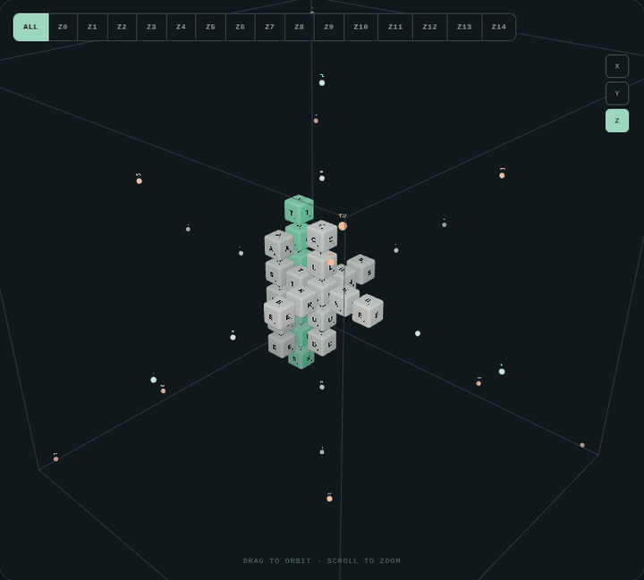
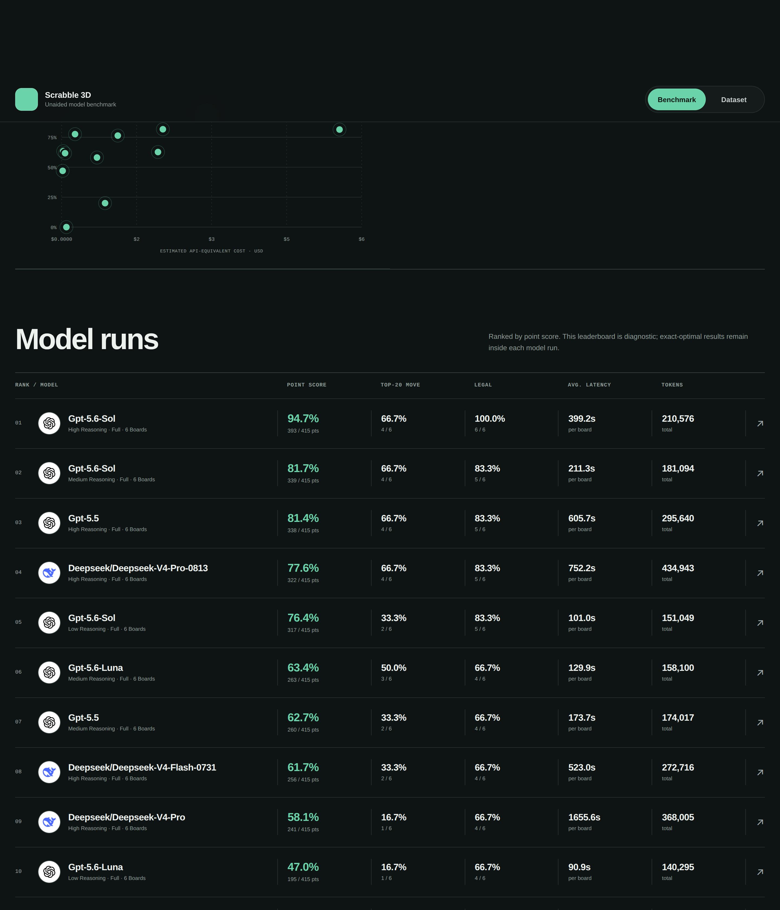
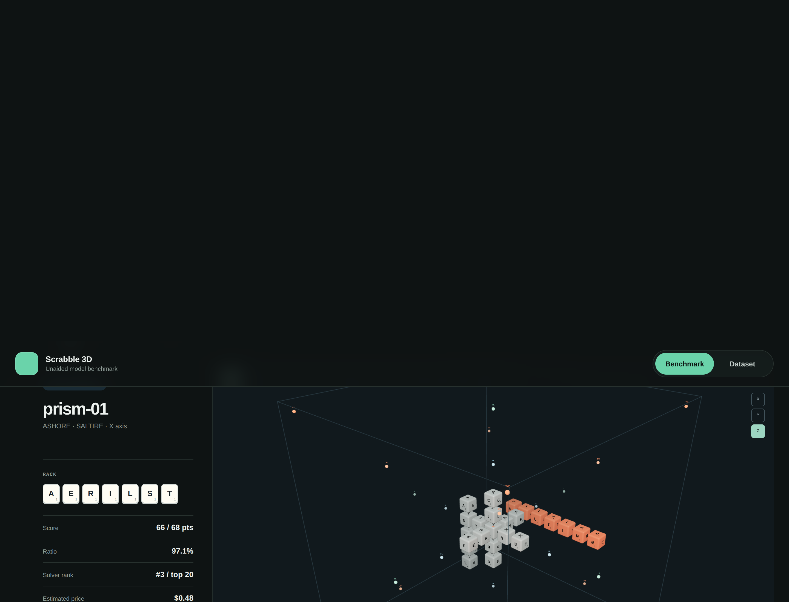
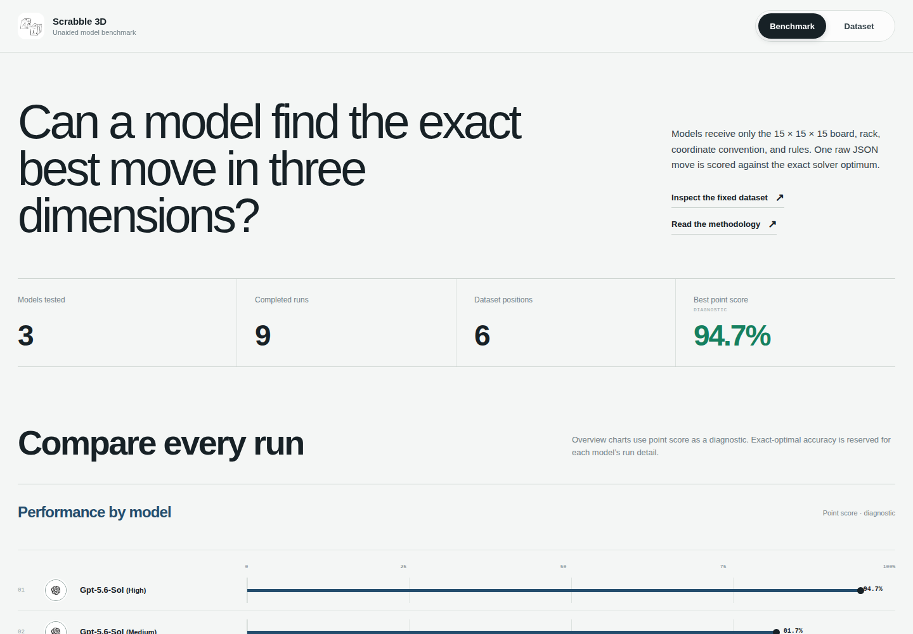
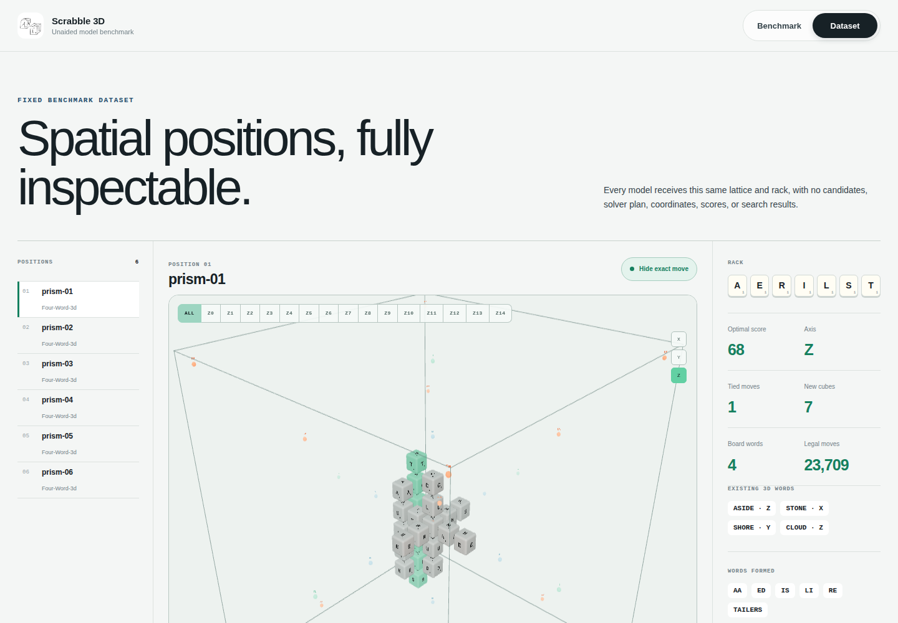

# Scrabble³ Benchmark

An exact-move benchmark for testing whether a language model can reason about
Scrabble in three spatial dimensions.

**Live demo: [benchmark-3D-scrabble.calgarypermit.ca](https://benchmark-3D-scrabble.calgarypermit.ca)**



*Fixed lattice on the [live demo](https://benchmark-3D-scrabble.calgarypermit.ca). Highlighted cubes are the exact move. [Play the video](docs/media/board-orbit.mp4).*



*Model runs on the live demo, ranked by point score. Exact-optimal accuracy is reported on each run.*



*One board from a completed run, with the submitted placement highlighted.*



*Benchmark dashboard before any runs are recorded.*



*Dataset explorer for one fixed position, with the exact move highlighted.*

The benchmark preserves the contract of
[`cochon123/benchmark_scrabble`](https://github.com/cochon123/benchmark_scrabble):
the model receives only a fixed board and rack, returns one move, and is scored
against an exact solver. Here, every tile occupies an `(x, y, z)` cube and words
may run on the X, Y, or Z axis.

## Rules

- The board is a `15 × 15 × 15` lattice with center `(7, 7, 7)`.
- A move places up to seven tiles on one axis.
- Every main and cross-word (across either of the two perpendicular axes) must
  be in the lexicon.
- Premium cubes apply only when a tile is first placed.
- Seven new tiles earn a 50-point spatial bingo.
- The benchmark target is unaided board+rack → one legal, exact-optimal move.

Every fixed position starts with at least four connected words spanning all
three axes, so even the smoke board requires genuinely spatial reasoning.
The evaluator also freezes the solver's top 20 moves and reports the submitted
move's tie-aware rank (`#1`, `#2`, …, or `>20`). Top-20 rate and rank are
diagnostics only; they do not change the exact-optimal benchmark target.

The 15-cube lattice contains 3,375 cubes, about 9.84 times the volume of the
original 7-cube prototype. Inner premium coordinates scale from `1/5` to
`3/11`, preserving the rotationally symmetric premium geometry. This revision
uses dataset id `15x15x15-v2`; results from earlier datasets are retained but
must not be compared on the same leaderboard.

## Setup

```bash
python3 -m pip install -e .
python3 -m scrabble3d_bench generate-dataset

cd web
npm install
npm run dev
```

Open `http://localhost:3000` for the interactive spatial board, dataset explorer,
protocol, and run history.

## Run with Codex through cli2api

Start the latest [`cochon123/cli2api`](https://github.com/cochon123/cli2api)
from its `main` branch in another terminal. The project currently publishes no
release tags; the latest upstream commit checked for this README is
`0715e222d9229bb97e662f21cf7e5476fbbf19fd`. It stays on loopback and requires
a bearer token.

```bash
# latest cli2api
git clone https://github.com/cochon123/cli2api.git
cd cli2api
git switch main
git pull --ff-only origin main
CLI2API_TOKEN=local-benchmark npm run serve -- --adapter codex --port 3927

# from this project
CLI2API_TOKEN=local-benchmark python3 -m scrabble3d_bench run \
  --model codex/gpt-5.6-luna \
  --reasoning-effort low \
  --preset smoke
```

The client sends `reasoning_effort: "low"` through the OpenAI-compatible chat
endpoint. Results are saved under `data/results/` and appear in the web UI.

## Commands

```bash
python3 -m scrabble3d_bench generate-dataset
python3 -m scrabble3d_bench inspect --position prism-01
python3 -m scrabble3d_bench run --preset smoke
python3 -m pytest
```

Use a licensed `data/lexicon/NWL23.txt` when available. The repository ships
with ENABLE for reproducible development runs.
